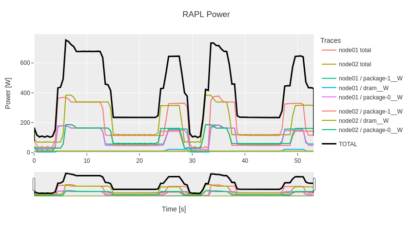

# praplr -- Parallel RAPL Reader

This tiny utility (no dependencies) allows portable energy measurements of arbitrary applications across multiple nodes using the Linux [power capping framework](https://docs.kernel.org/power/powercap/powercap.html).

## How to use it

Just modify your

```bash
mpirun -np 128 mysolver arg1 arg2
```

commands into

```bash
# Optional:
# export PRAPLR_INTERVAL_MS=500
mpirun -np 128 praplr -o ./praplr-output -- mysolver arg1 arg2
```

or use it with another parallel launcher or even sequential codes.

The per-node and total energy and power consumption can be generated using

```bash
python3 parplr-summarize.py ./praplr-output
```

Visualize the power utilization using

```bash
# pip install pandas plotly
python3 plot-power.py ./praplr-output
```



## How it works

For each node, exactly one sampler process is started.
To achieve this, all processes try to bind to a local Unix socket, which acts as the selection mechanism.
The winner creates a child process for sampling.  
All (parent) processes proceed to be replaced with the main (MPI) application.  
When these processes terminate, the corresponding sampler processes are also terminated.
